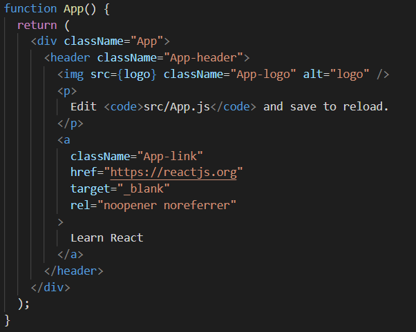

# Blog
JS React

 FILES & FOLDERS:

1. node_modules : contains all project dependencies.

2. public : 
   
   * public to the browser 

   * "index.html" inside the public folder has a "div" of id="root" to which the component is rendered ("App" component inside the "index.js" within the src folder.)

   * The "App" component in the "index.js" file is rendered to the DOM means, the entire component "App" inside the "App.js" file is rendered to the DOM.

3. src

* it has the "index.js" file that kick starts the project.

<!-- //////////// -->

More Points 

1. jsx 

 * the syntax looks like html.

 * The transpiler called "babel" converts all the jsx into html on saving and is then rendered to the DOM.

 * In jsx class is added as "className" attribute. Not "class" since that is a reserved keyword in JS and the file is a js file.

 

 2. Component

 * It is basically a function.
 * It returns whatever is within the function usually a jsx template.
 * Then we export the component so that we can use it in other files. (see the export in the "App.js" and the import in the "index.js")

 * Component consists of two parts : 

   1. Template  : refers to the HTML content or structure
   2. Logic  : refers to the js functions or other functionality codes.

1. TEMPLATE 

* All the JS code should be before the "return" statement inside the App commponent in the App.js file. 
* This can include variables and other codes.

* variable initialisation : follows the usual trend as in JS.

* Using them in the "return" statement : USE CURLY BRACES {}

** Note : return statement returns jsx.
* React will identify the curly braces for variable and search for it inside the entire App component.

* inside curly braces, it is possible to write js codes directly.

* variables,strings,numbers,arrays etc. can be shown as output. Arrays are converted to strings.

* IT IS IMPOSSIBLE TO OUTPUT BOOLEANS AND OBJECTS ON SIMILAR GROUNDS!

* Attribute values can also be variables.

* COMPONENT TREE : 

* Creating a new component :

1. A new component is created within the "src" folder. Eg ; Navbar.js

2. Using "Simple React Components" extension, "sfc" can be created easily. Only name and other external parameters need to be added.

   * sfc : stateless functional component

* ALL STYLES IN THIS PROJECT IS DONE ON THE INDEX.CSS

* Inline styles :

  1. Single {} represents dynamic value while double {{}} represnts :
       * outer : dynamic
       * inner : object

 2. Inline is added as object.     

* Events

   1. click : 

   * function is created initially
   * reference is given at the desired place in {}
   * never invoke the function inside the {} using ()
   * all we need is reference to the function
   * if invoked already, the output is seen before the event.

